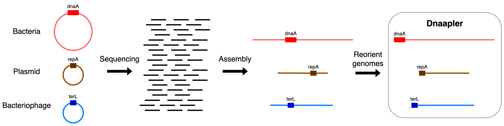

[](https://colab.research.google.com/github/gbouras13/dnaapler/blob/master/run_dnaapler.ipynb)

[](https://doi.org/10.21105/joss.05968)

[](https://github.com/gbouras13/dnaapler/actions/workflows/ci.yaml)
[](https://codecov.io/gh/gbouras13/dnaapler)
[](https://github.com/psf/black)
[](https://zenodo.org/doi/10.5281/zenodo.10039420)

[](https://anaconda.org/bioconda/dnaapler)
[](https://img.shields.io/conda/dn/bioconda/dnaapler)
[](https://badge.fury.io/py/dnaapler)
[](https://pepy.tech/project/dnaapler)


# dnaapler

Dnaapler is a simple tool that reorients complete circular microbial genomes.

## Quick Start

```
# creates empty conda environment
conda create -n dnaapler_env

# activates conda environment
conda activate dnaapler_env

# installs dnaapler
conda install -c bioconda dnaapler

# runs dnaapler all 
dnaapler all -i input_mixed_contigs.fasta -o output_directory_path -p my_bacteria_name -t 8

# runs dnaapler chromosome
dnaapler chromosome -i input_chromosome.fasta -o output_directory_path -p my_bacteria_name -t 8

```

## Paper

Dnaapler has been published in JOSS [here](https://joss.theoj.org/papers/10.21105/joss.05968). If you use Dnaapler in your work, please cite it as follows:

```

George Bouras, Susanna R. Grigson, Bhavya Papudeshi, Vijini Mallawaarachchi, Michael J. Roach (2024). Dnaapler: A tool to reorient circular microbial genomes. Journal of Open Source Software, 9(93), 5968, https://doi.org/10.21105/joss.05968

```

Additionally, please consider citing the dependencies where relevant:

```
Altschul S.F., Gish W., Miller W., Myers E.W., Lipman D.J. Basic local alignment search tool. J Mol Biol. 1990 Oct 5;215(3):403-10. doi: 10.1016/S0022-2836(05)80360-2. PMID: 2231712.

Steinegger M, Söding J. MMseqs2 enables sensitive protein sequence searching for the analysis of massive data sets. Nat Biotechnol. 2017 Nov;35(11):1026-1028. doi: 10.1038/nbt.3988.

Larralde, M., (2022). Pyrodigal: Python bindings and interface to Prodigal, an efficient method for gene prediction in prokaryotes. Journal of Open Source Software, 7(72), 4296, https://doi.org/10.21105/joss.04296.

Hyatt, D., Chen, GL., LoCascio, P.F. et al. Prodigal: prokaryotic gene recognition and translation initiation site identification. BMC Bioinformatics 11, 119 (2010). https://doi.org/10.1186/1471-2105-11-119.
```

## v1.0.0

* **BREAKING CHANGE** - `dnaapler` now uses `MMSeqs2 v13.45111` rather than `BLAST`. You will need to install [MMSeqs2](https://github.com/soedinglab/MMseqs2) if you upgrade (if you use conda, it should be handled for you)
* There are 2 reasons for this:
    1. Users reported problems installing BLAST on MacOS with Apple Silicon (see e.g. [here](https://github.com/gbouras13/pharokka/issues/368)). MMseqs2 works on all platforms and is dilligently maintained.
    2. MMSeqs2 is much much faster than BLAST (what took BLAST a few minutes takes MMSeqs2 seconds). We probably should have written `dnaapler` with `MMseqs2` to begin with. `MMSeqs2 v13.45111` was chosen to ensure interoperability with [pharokka](https://github.com/gbouras13/pharokka)
* The alignment resuls may not be identicial to ` dnaapler v0.8.1` (i.e. they might find different top hits), but the actual reorientation is likely to be identical (at least in my tests). Please reach out or make an issue if you notice any discrepancies


# Google Colab Notebooks

If you don't want to install `dnaapler` locally, you can run `dnaapler all` without any code using the [Google Colab notebook](https://colab.research.google.com/github/gbouras13/dnaapler/blob/master/run_dnaapler.ipynb).

## Table of Contents
- [dnaapler](#dnaapler)
  - [Quick Start](#quick-start)
  - [Paper](#paper)
  - [v1.0.0](#v100)
- [Google Colab Notebooks](#google-colab-notebooks)
  - [Table of Contents](#table-of-contents)
  - [Description](#description)
  - [Documentation](#documentation)
  - [Commands](#commands)
  - [Installation](#installation)
    - [Conda](#conda)
    - [Pip](#pip)
  - [Usage](#usage)
  - [Example Usage](#example-usage)
  - [Databases](#databases)
  - [Motivation](#motivation)
  - [Contributing](#contributing)
  - [Acknowledgements](#acknowledgements)

## Description

<p align="center">
  
</p>

`dnaapler` is a simple python program that takes a single nucleotide input sequence (in FASTA format), finds the desired start gene using `MMseqs2` against an amino acid sequence database, checks that the start codon of this gene is found, and if so, then reorients the chromosome to begin with this gene on the forward strand. 

It was originally designed to replicate the reorientation functionality of [Unicycler](https://github.com/rrwick/Unicycler/blob/main/unicycler/gene_data/repA.fasta) with dnaA, but for for long-read first assembled chromosomes. We have extended it to work with plasmids (`dnaapler plasmid`) and phages (`dnaapler phage`), or for any input FASTA desired with `dnaapler custom`, `dnaapler mystery` or `dnaapler nearest`.

For bacterial chromosomes, `dnaapler chromosome` should ensure the chromosome breakpoint never interrupts genes or mobile genetic elements like prophages. It is intended to be used with good-quality completed bacterial genomes, generated with methods such as [Trycycler](https://github.com/rrwick/Trycycler/wiki), [Dragonflye](https://github.com/rpetit3/dragonflye) or my own pipeline [hybracter](https://github.com/gbouras13/hybracter).

Additionally, you can also reorient multiple bacterial chromosomes/plasmids/phages at once using the `dnaapler bulk` subcommand.

If your input FASTA is mixed (e.g. has chromosome and plasmids), you can also use `dnaapler all`, with the option to ignore some contigs with the `--ignore` parameter.

## Documentation

The full documentation for `dnaapler` can be found [here](https://dnaapler.readthedocs.io).

## Commands

* `dnaapler all`: Reorients 1 or more contigs to begin with any of dnaA, terL, repA or COG1474. 
  - Practically, this should be the most useful command for most users.

* `dnaapler chromosome`: Reorients your sequence to begin with the dnaA chromosomal replication initiator gene
* `dnaapler plasmid`: Reorients your sequence to begin with the repA plasmid replication initiation gene
* `dnaapler phage`: Reorients your sequence to begin with the terL large terminase subunit gene
* `dnaapler archaea`: Reorients your sequence to begin with the [COG1474 archaeal Orc1/cdc6 gene](https://www.ncbi.nlm.nih.gov/research/cog/cog/COG1474/).
* `dnaapler custom`: Reorients your sequence to begin with a custom amino acid FASTA format gene that you specify
* `dnaapler mystery`: Reorients your sequence to begin with a random CDS
* `dnaapler largest`: Reorients your sequence to begin with the largest CDS
* `dnaapler nearest`: Reorients your sequence to begin with the first CDS (nearest to the start). Designed for fixing sequences where a CDS spans the breakpoint.
* `dnaapler bulk`: Reorients multiple contigs to begin with the desired start gene - either dnaA, terL, repA or a custom gene.


## Installation

`dnaapler` requires only BLAST v2.10 or higher as an external dependency. 

Installation from conda is highly recommended as this will install BLAST automatically.

### Conda

`dnaapler` is available on bioconda.

```
conda install -c bioconda dnaapler
```

### Pip

You can also install `dnaapler` with pip.

```
pip install dnaapler
```

* If you install `dnaapler` with pip, then you will then need to install BLAST v 2.9 or higher separately. It will need to be available in the `$PATH` or else `dnaapler` will not work. 


## Usage

```
Usage: dnaapler [OPTIONS] COMMAND [ARGS]...

Options:
  -h, --help     Show this message and exit.
  -V, --version  Show the version and exit.

Commands:
  all         Reorients contigs to begin with any of dnaA, repA...
  archaea     Reorients your genome to begin with the archaeal COG1474...
  bulk        Reorients multiple genomes to begin with the same gene
  chromosome  Reorients your genome to begin with the dnaA chromosomal...
  citation    Print the citation(s) for this tool
  custom      Reorients your genome with a custom database
  largest     Reorients your genome the begin with the largest CDS as...
  mystery     Reorients your genome with a random CDS
  nearest     Reorients your genome the begin with the first CDS as...
  phage       Reorients your genome to begin with the terL large...
  plasmid     Reorients your genome to begin with the repA replication...
  ```

  ```
Usage: dnaapler all [OPTIONS]

  Reorients contigs to begin with any of dnaA, repA, terL or archaeal COG1474 Orc1/cdc6

Options:
  -h, --help               Show this message and exit.
  -V, --version            Show the version and exit.
  -i, --input PATH         Path to input file in FASTA format  [required]
  -o, --output PATH        Output directory   [default: output.dnaapler]
  -t, --threads INTEGER    Number of threads to use with BLAST  [default: 1]
  -p, --prefix TEXT        Prefix for output files  [default: dnaapler]
  -f, --force              Force overwrites the output directory
  -e, --evalue TEXT        e value for MMseqs2  [default: 1e-10]
  --ignore PATH            Text file listing contigs (one per row) that are to
                           be ignored
  -a, --autocomplete TEXT  Choose an option to autocomplete reorientation if
                           BLAST based approach fails. Must be one of: none,
                           mystery, largest, or nearest [default: none]
  --seed_value INTEGER     Random seed to ensure reproducibility.  [default:
                           13]
  ```

The reoriented output FASTA will be `{prefix}_reoriented.fasta` in the specified output directory.

## Example Usage

* For more detailed example usage, please see the [examples](https://dnaapler.readthedocs.io/en/latest/example/) section of the documentation. 

```
dnaapler all -i input.fasta -o output_directory_path -p my_genome_name --ignore list_of_contigs_to_ignore.txt
```

```
dnaapler chromosome -i input.fasta -o output_directory_path -p my_bacteria_name -t 8
```

```
dnaapler phage -i input.fasta -o output_directory_path -p my_phage_name -t 8
```

```
dnaapler plasmid -i input.fasta -o output_directory_path -p my_plasmid_name -t 8
```

```
dnaapler archaea -i input.fasta -o output_directory_path -p my_archaea_name -t 8
```

```
dnaapler custom -i input.fasta -o output_directory_path -p my_genome_name -t 8 -c my_custom_database_file
```

```
dnaapler mystery -i input.fasta -o output_directory_path -p my_genome_name
```

```
dnaapler nearest -i input.fasta -o output_directory_path -p my_genome_name
```

```
dnaapler largest -i input.fasta -o output_directory_path -p my_genome_name
```

```
# to reorient multiple bacterial chromosomes
dnaapler bulk -i input_file_with_multiple_chromosomes.fasta -m chromosome -o output_directory_path -p my_genome_name 
```

## Databases

`dnaapler chromosome` uses 584 proteins downloaded from Swissprot with the query "Chromosomal replication initiator protein DnaA" on 24 May 2023 as its database for dnaA. All hits from the query were also filtered to ensure "GN=dnaA" was included in the header of the FASTA entry.

`dnaapler plasmid` uses the repA database curated by Ryan Wick in [Unicycler](https://github.com/rrwick/Unicycler/blob/main/unicycler/gene_data/repA.fasta).

`dnaapler phage` uses a terL database curated using [PHROGs](https://phrogs.lmge.uca.fr). All the AA sequences of the 55 phrogs annotated as 'large terminase subunit' were downloaded, combined and depduplicated using [seqkit](https://github.com/shenwei356/seqkit) `seqkit rmdup -s -o terL.faa phrog_terL.faa`.

`dnaapler archaea` uses a database of 403 archaeal COG1474 Orc1/cdc6 genes curated from [here](https://ftp.ncbi.nlm.nih.gov/pub/wolf/COGs/arCOG/).

`dnaapler all` uses all four databases combined into one. 

`dnaapler custom` uses a custom amino acid FASTA format file that you specify using `-c`. 

The matching is strict - it requires a strong BLASTx match (default e-value 1E-10), and the first amino acid of a BLASTx hit gene to be identified as Methionine, Valine or Leucine, the 3 most used start codons in bacteria/phages. 

For the most commonly studied microbes (ESKAPE pathogens, etc), the dnaA database should suffice.

If you try `dnaapler` on a more novel or under-studied microbe with a dnaA gene that has little sequence similarity to the database, you may need to provide your own dnaA gene(s) in amino acid FASTA format using `dnaapler custom`.

After this [issue](https://github.com/gbouras13/dnaapler/issues/1), `dnaapler mystery` was added. It predicts all ORFs in the input using [pyrodigal](https://github.com/althonos/pyrodigal), then picks a random gene to re-orient your sequence with.

## Motivation

1. I couldn't get [Circlator](https://sanger-pathogens.github.io/circlator/) to work and it is no longer supported.
2. [berokka](https://github.com/tseemann/berokka) doesn't orient chromosomes to begin with dnaa.
3. After reading Ryan Wick's masterful bacterial genome assembly [tutorial](https://github.com/rrwick/Perfect-bacterial-genome-tutorial/wiki), I realised that it is probably optimal to run 2 polishing steps, once before then once after rotating the chromosome, to ensure the breakpoint is polished. Further, for some "complete" long read bacterial assemblies that didn't circularise properly, I figured that as long as you have a complete assembly (even if not "circular" as marked as in Flye), polishing after a re-orientation would be likely to circularise the chromosome. A bit like Ryan's [rotate_circular_gfa.py](https://github.com/rrwick/Perfect-bacterial-genome-tutorial/blob/main/scripts/rotate_circular_gfa.py) script, without the requirement of strict circularity.
4. While researching MGEs in _S. aureus_ whole genome sequences, I repeatedly found instances where MGEs were interrupted by the chromosome breakpoint. So I thought I'd add a tool to automate it in my pipeline. 
5. It's probably good to have all your sequences start at the same location for synteny analyses.

## Contributing

If you would like to help improve  `dnaapler` you are very welcome!

For changes to be accepted, they must pass the CI checks. 

Please see [CONTRIBUTING.md](CONTRIBUTING.md) for more details.

## Acknowledgements

Thanks to Torsten Seemann, Ryan Wick and the Circlator team for their existing work in the space. Also to [Michael Hall](https://github.com/mbhall88), whose repository [tbpore](https://github.com/mbhall88/tbpore) we took and adapted a lot of scaffolding code from because he writes really nice code.

